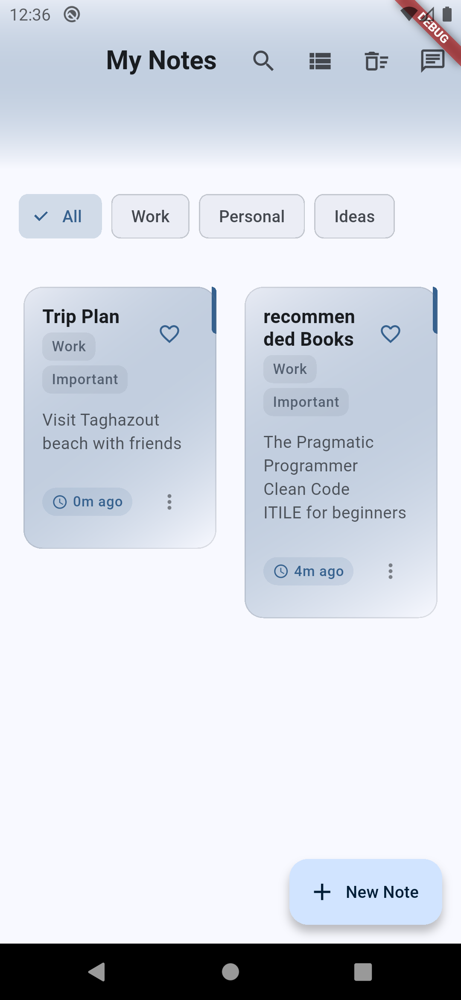
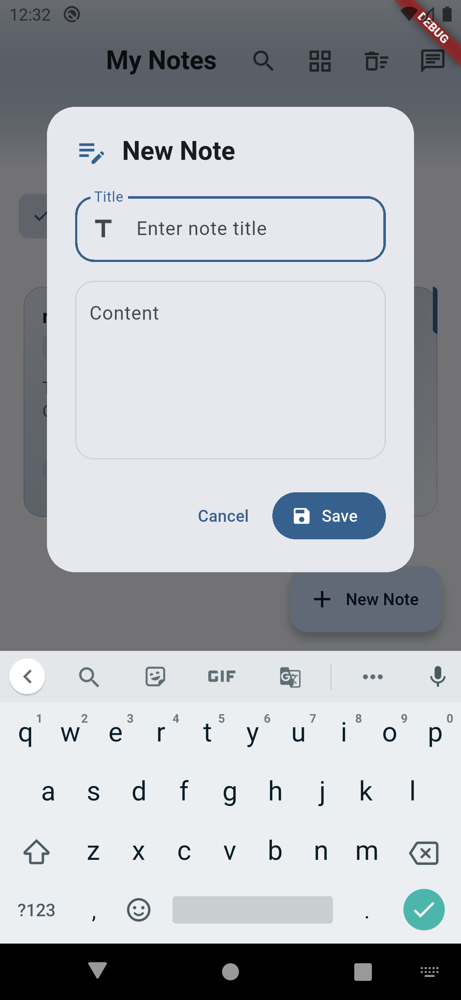
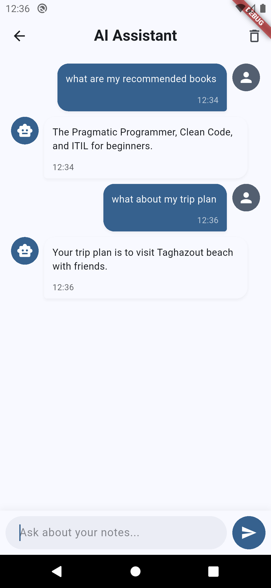
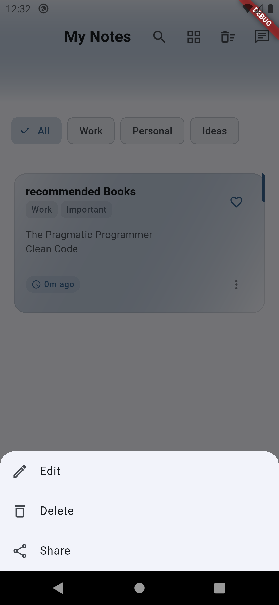

# Notely AI

Notely AI is a modern note-taking application with AI-powered features, built using Flutter. It combines the simplicity of note-taking with the power of artificial intelligence to help you organize and manage your notes more effectively.

## 📱 Screenshots

<div align="center">
  
  
  
  
</div>

*From left to right: Home Screen, Note Creation, AI Chat, and Note Management interfaces*

## Features

### 📝 Note Management
- Create, edit, and delete notes
- Beautiful card-based UI with grid and list views
- Rich text formatting
- Note categorization with tags
- Favorite notes for quick access
- Search functionality
- Timestamp tracking

### 🤖 AI Integration
- AI-powered chat assistant
- Smart note analysis
- Context-aware responses
- Natural language processing
- Intelligent note suggestions

### 🎨 Modern UI/UX
- Material Design 3
- Dark/Light theme support
- Responsive layout
- Smooth animations
- Intuitive navigation
- Beautiful gradients and visual effects

### 🔒 Security
- Encrypted note storage
- Secure data handling
- Privacy-focused design

## Data Storage

### Local Storage
- Notes are stored locally using Hive database
- Data is persisted between app sessions
- Automatic data synchronization
- Secure storage with encryption support

### Storage Location
- Notes are stored in the app's local storage directory
- Hive boxes:
  - `notes`: Stores all user notes
  - `chat_messages`: Stores chat history

### Data Models
- `Note`: Persisted in Hive with automatic serialization
- `ChatMessage`: Stored in Hive for chat history

## Project Structure

```
lib/
├── main.dart                 # Application entry point
├── models/                   # Data models
│   ├── note.dart            # Note model with Hive integration
│   └── chat_message.dart    # Chat message model
├── providers/               # State management
│   ├── notes_provider.dart  # Notes state and CRUD operations
│   └── chat_provider.dart   # Chat state and AI interactions
├── screens/                 # UI screens
│   ├── home_screen.dart     # Main notes screen with grid/list views
│   └── chat_screen.dart     # AI chat interface
├── services/               # Business logic and external integrations
│   └── ai_service.dart     # Gemini AI integration service
└── widgets/               # Reusable UI components
    ├── note_card.dart     # Note card widget for grid/list views
    ├── search_bar.dart    # Custom search bar implementation
    └── chat_bubble.dart   # Chat message bubble widget
```

## Key Components

### Models
- `Note`: Represents a note with title, content, timestamps, and Hive persistence
- `ChatMessage`: Represents an AI chat message with user/AI role and timestamp

### Providers
- `NotesProvider`: Manages note state, CRUD operations, and Hive persistence
- `ChatProvider`: Handles chat history, message state, and AI interactions

### Screens
- `HomeScreen`: Main interface with note management, search, and AI chat access
- `ChatScreen`: AI chat interface with message history and real-time responses

### Services
- `AIService`: Handles Gemini AI integration, prompt engineering, and response processing

### Widgets
- `NoteCard`: Reusable card widget for displaying notes in grid/list views
- `SearchBar`: Custom search implementation with real-time filtering
- `ChatBubble`: Message bubble widget for the chat interface

## Getting Started

### Prerequisites
- Flutter SDK (latest version)
- Dart SDK (latest version)
- Google AI API key

### Installation
1. Clone the repository
```bash
git clone https://github.com/roxm337/notely_ai.git
```

2. Install dependencies
```bash
flutter pub get
```

3. Create a `.env` file in the root directory and add your API key
```
GOOGLE_AI_API_KEY=your_api_key_here
```

4. Run the app
```bash
flutter run
```

## Dependencies

- `flutter`: UI framework
- `provider`: State management
- `hive`: Local storage
- `google_generative_ai`: AI integration
- `flutter_markdown`: Markdown rendering
- `flutter_staggered_grid_view`: Grid layout
- `encrypt`: Data encryption
- `flutter_dotenv`: Environment variables


